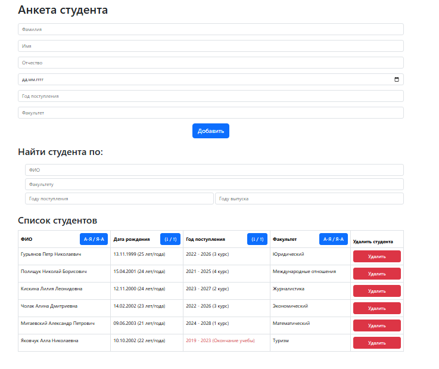
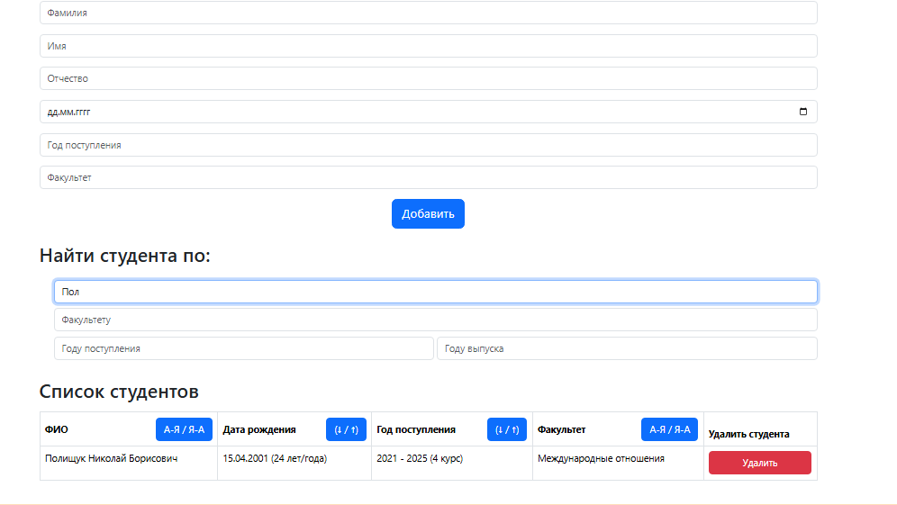

# Students List

## Description
This is a student management application called **Students List**. It allows you to add, delete, sort, and filter students. The application provides a user-friendly interface for managing student data and displays it in a table format.

## Installation

### Frontend Setup
1. Clone the repository:
   ```sh
   git clone https://git@github.com:kate8382/students_list.git
   ```
2. Navigate to the project directory:
   ```sh
   cd students_list
   ```
3. Install dependencies:
   ```sh
   npm install
   ```

### Backend Setup
1. Navigate to the `backend` directory:
   ```sh
   cd backend
   ```
2. Install the dependencies:
   ```sh
   npm install
   ```
3. Start the server using npm:
   ```sh
   npm start
   ```
   Alternatively, you can start the server using Node.js directly:
   ```sh
   node index.js
   ```

## Usage
1. Open the `index.html` file in your browser.
2. Use the form to add new students.
3. Sort and filter the student list by various criteria.
4. Delete students from the table.

## Screenshots
Here are some screenshots of the application:





## Contributing
If you would like to contribute to this project, please follow these steps:
1. Fork the repository.
2. Create a new branch:
   ```sh
   git checkout -b feature-branch
   ```
3. Make your changes and commit them:
   ```sh
   git commit -m "Add new feature"
   ```
4. Push to the branch:
   ```sh
   git push origin feature-branch
   ```
5. Create a new Pull Request.

## License
This project is licensed under the MIT License. See the [LICENSE](LICENSE) file for more details.
