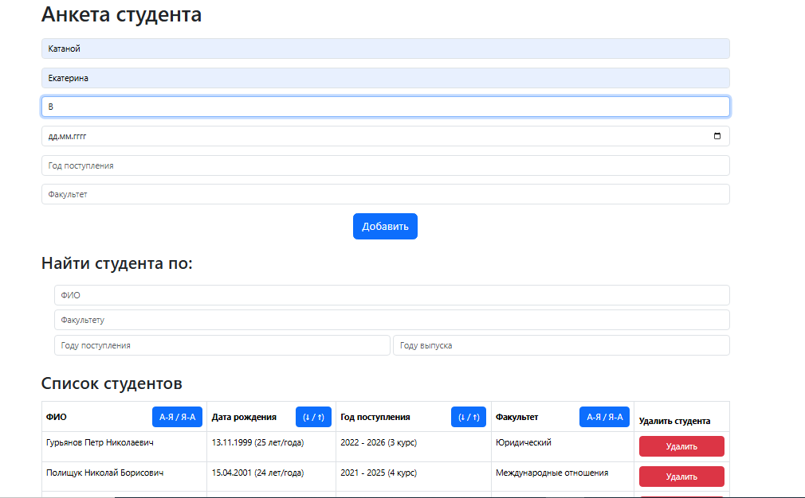

# Students List

## Description
This is a student management application called **Students List**. It allows you to add, delete, sort, and filter students. The application provides a user-friendly interface for managing student data and displays it in a table format. This project was also used to practice JavaScript event loop, promises, and asynchronous operations in real-world scenarios.

> ⚠️ **Warning:** Without running the backend server, manipulations on the page such as adding/deleting a student, as well as sorting and filtering the students table, are not possible.

## Features

- Modular code structure (separated API and UI logic)
- Asynchronous data loading and updating with `fetch` and `async/await`
- Global Bootstrap spinner for loading indication
- User-friendly error alerts (Bootstrap alert)
- Sorting and filtering students in real time

## Useful Links

- [Bootstrap 5 Documentation](https://getbootstrap.com/docs/5.3/getting-started/introduction/)
- [MDN: JavaScript Event Loop](https://developer.mozilla.org/en-US/docs/Web/JavaScript/EventLoop)

## Installation

### Frontend Setup
1. Clone the repository:
   ```sh
   git clone https://git@github.com:kate8382/students_list.git
   ```
2. Navigate to the project directory:
   ```sh
   cd students_list
   ```
3. Install dependencies:
   ```sh
   npm install
   ```

### Backend Setup
1. Navigate to the `backend` directory:
   ```sh
   cd backend
   ```
2. Install the dependencies:
   ```sh
   npm install
   ```
3. Start the server using npm:
   ```sh
   npm start
   ```
   Alternatively, you can start the server using Node.js directly:
   ```sh
   node index.js
   ```

## Usage
1. Start the backend server according to the instructions above.
2. Open the `docs/index.html` file in your browser.
3. Use the form to add new students.
4. Sort and filter the list of students by various criteria.
5. Delete students from the table.

## Screenshots
Here are some screenshots of the application:





## Contributing
If you would like to contribute to this project, please follow these steps:
1. Fork the repository.
2. Create a new branch:
   ```sh
   git checkout -b feature-branch
   ```
3. Make your changes and commit them:
   ```sh
   git commit -m "Add new feature"
   ```
4. Push to the branch:
   ```sh
   git push origin feature-branch
   ```
5. Create a new Pull Request.

## License
This project is licensed under the MIT License. See the [LICENSE](LICENSE) file for more details.
